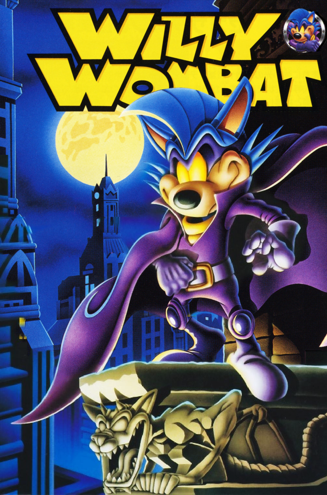

# Willy Wombat English Improvement Patch
An English improvement patch for the Sega Saturn Japanese exclusive, <a href=https://segaretro.org/Willy_Wombat>Willy Wombat</a>.

## **Overview**
Willy Wombat is a charming 3D platformer/collectathon for the Sega Saturn. It features fully-voiced English audio, so it's very playable for English speakers. However, key menus are in Japanese, so this patch redraws several elements in English. Changes include:

- Title RAM choice translated
- Translated Options menu
- Translated Save/Load menu
- All English interstitial loading screens

What is *not* changed:

- The Japanese subtitles during character dialogue. We searched high and low in the game files, but could not source these. Perhaps for a future patch release.

## **Screens**

<!-- Row 1 -->

  
  

<!-- Row 2 -->

  
  

## **Patching Instructions**

1. Unzip patch bundle
2. Open **'SegaSaturnPatcher.exe'** (It can be downloaded <a href=https://segaxtreme.net/threads/sega-saturn-patcher-discussion-thread.24721/>here</a>. The most current version is V1.91)
3. After it opens, click **'Select Saturn Game'**
4. Next click **'CD Image'**
5. Find your original disc image on your computer, then click **'Open'**
6. Click the **'+ Game Patch (SSP)'** button
7. Go to where you unzipped the patch bundle and locate <kbd>Willy_Wombat_Improvement_Patch_vX.X</kbd> and click **'Open'**
8. Finally, select **'Build Image'** and choose a directory to save it to
9. Burn to disc and play in your Sega Saturn or play in your favorite Sega Saturn emulator

**--> Important! <--**
- Tested with <kbd>Willy Wombat (Japan)</kbd>

## **Credits**

**Translation**
- Exxistance

**Texture Art**
- Exxistance

**QA**
- Exxistance
- Rasputin3000

**Special Thanks**
- Rasputin3000 (for championing this game and bringing it to my attention)
- Bo Bayles of <a href=https://32bits.substack.com/>Rings of Saturn</a>
- the <a href=https://mushroom32x.neocities.org/Willy%20Wombat/>Willy Wombat 20th Anniversary Webpage</a> (a beautiful resource to learn more about the game) 
